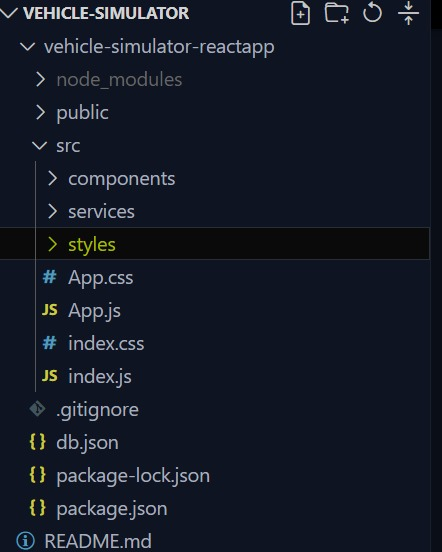

Steps to install and running the project:

- Clone this repository to a folder.
- Change the directory to vehicle-simulator-reactapp.
- Install the node_modules by using the command "npm install"
- Start the application by using the command "npm start". 
- It will start both the application and server simultaneously.
- Check the frontend at the port 3000.
- Verify the json-server running at the port 5000.
- The application will start running.

About the Project:
- The json-server works as mocking Restapi , which is used as backend.
- There are two schema in this project (i.e)Scenario and Vehicles.
- The schemas are created in the db.json file in the root directory which works as the datastore.
- The json was made explicitly to run on the port 5000.

- The nodejs package called "Concurrently" is used to run multiple commands simultanelously.
- I have used this package to run both the client and server simultaneously on different ports.

- There are three major folders in the src folder namely components,services and styles.
- The components module contains all the pages of the application.
- The services module contains the api service modules which handles the interactions with your application's backend API and it contains methods for performing CRUD (Create, Read, Update, Delete) operations on resources like users, scenarios, vehicles, etc.
- The services modules use libraries like Axios to make HTTP requests to the API endpoints.
- The styles module contains the CSS file for all the pages in the application.
